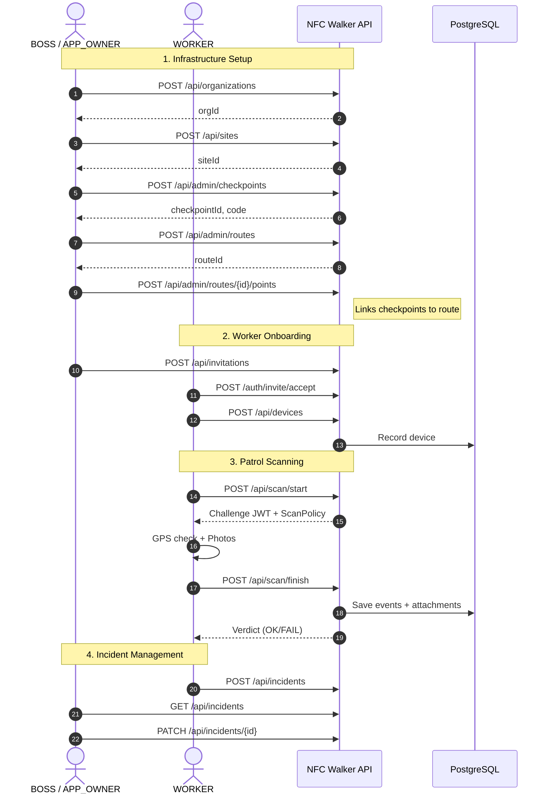

# NFC Walker

NFC-based patrol tracking and security monitoring system. Built with Kotlin, Micronaut, and PostgreSQL. Supports local deployment (Netty)
and serverless (AWS Lambda, GCP Cloud Functions).

## 🚀 Quick Start

```bash
# Build and start services
./gradlew shadowJar -Plocal
docker-compose up -d

# Verify health
curl http://localhost:8080/health
```

⚠️ **First time?** You must configure secrets in `.env.docker` before starting services.  
See [Local Setup Guide](docs/RUNNING_LOCALLY.md) for details.

**Quick fix if app fails to start:**

```bash
# Auto-generate secrets
sed -i.bak "s/<REPLACE_WITH_SECURE_32_CHAR_STRING>/$(openssl rand -base64 32)/g" .env.docker
docker-compose restart app
```

## 📚 Documentation

- 📖 **[API Specification](https://tiger8bit.github.io/nfcwalker/)** – OpenAPI 3.0.1
- 🔧 **[Local Development](docs/RUNNING_LOCALLY.md)** – Docker setup and troubleshooting
- 🧪 **[Postman Collection](docs/nfcwalker.postman_collection.json)** – Idempotent test suite
- 📊 **[System Diagrams](docs/diagrams/)** – User flows, domain model, lifecycle

## ✨ Key Features

- **Multi-tenant architecture** – Organizations, sites, checkpoints
- **Role-based access** – APP_OWNER, BOSS, WORKER
- **NFC checkpoint scanning** – GPS validation, photo verification, sub-checks
- **Patrol route management** – Schedule, monitor, and track patrol runs
- **Incident reporting** – Workers can report issues with photos/metadata
- **Challenge-response security** – Prevents scan replay attacks
- **Device management** – Register and track worker devices

## 🔄 System Architecture

Visual diagrams available in **[docs/diagrams](docs/diagrams/)**:

- **[User Flows](docs/diagrams/USER_FLOWS.md)** – Step-by-step API interactions
- **[Patrol Lifecycle](docs/diagrams/PATROL_LIFECYCLE.md)** – State machine for patrol runs
- **[Domain Model](docs/diagrams/DOMAIN_MODEL.md)** – Entity relationships

### High-Level Flow



## 🧪 Testing

### Postman Collection

The collection is **idempotent** and can be run repeatedly without errors:

```bash
# Start services
docker-compose up -d

# Import and run: docs/nfcwalker.postman_collection.json
```

**Features:**

- ✅ Auto database reset before each run
- ✅ Randomized values (checkpoints, devices)
- ✅ Automatic JWT token refresh
- ✅ Dev-only endpoints for testing

**Collection structure:**

1. **Setup** – Database reset
2. **Flow 1** – Owner creates org, invites Boss
3. **Flow 2** – Boss sets up infrastructure, invites Worker
4. **Flow 3** – Worker registers device, performs patrol

## 🛠 Technology Stack

- **Backend**: Kotlin + Micronaut 4.x
- **Database**: PostgreSQL with Flyway migrations
- **Security**: JWT (HS256) + Challenge-response
- **Deployment**: Docker / AWS Lambda / GCP Cloud Functions
- **Testing**: Postman (API), JUnit (unit tests)

## 🏗 Project Structure

```
nfcwalker/
├── src/main/kotlin/ge/tiger8bit/
│   ├── controller/      # REST endpoints
│   ├── service/         # Business logic
│   ├── repository/      # Data access (Micronaut Data)
│   ├── domain/          # JPA entities
│   └── dto/             # Data transfer objects
├── src/main/resources/
│   ├── application.yml           # Base config
│   ├── application-local.yml     # Local overrides
│   └── db/migration/             # Flyway SQL migrations
├── docs/
│   ├── diagrams/                 # Mermaid diagrams
│   ├── nfcwalker.postman_collection.json
│   └── openapi.yml               # API specification
├── docker-compose.yml
├── .env.docker                   # Local secrets
└── build.gradle.kts
```

## 🚀 Deployment

### Entry Points

- **Local (Netty)**: `ge.tiger8bit.ApplicationKt`
- **AWS Lambda**: `ge.tiger8bit.LambdaHandler`
- **GCP Cloud Functions**: `ge.tiger8bit.GcpHttpFunction`

### Environment Variables

Required for production (generate secure values):

```bash
# Security (minimum 32 bytes for HS256)
JWT_SECRET=$(openssl rand -base64 32)
APP_CHALLENGE_SECRET=$(openssl rand -base64 32)

# Database
JDBC_URL=jdbc:postgresql://host:5432/nfcwalker
JDBC_USER=your_user
JDBC_PASSWORD=your_password

# Optional: OAuth
OAUTH_GOOGLE_CLIENT_ID=...
OAUTH_GOOGLE_CLIENT_SECRET=...
```

See [RUNNING_LOCALLY.md](docs/RUNNING_LOCALLY.md) for detailed configuration.

## 📄 License

Proprietary © Tiger 8 Bit. All rights reserved.
