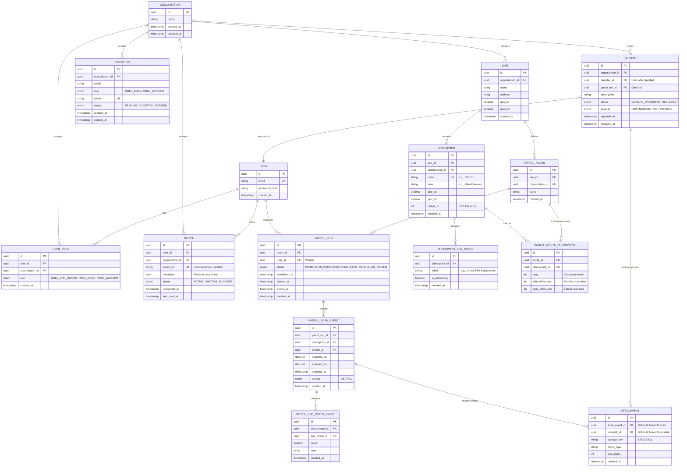

# Domain Model (Entity-Relationship Diagram)

This diagram illustrates the core entities and their relationships in the NFC Walker system. Essential for understanding data structure, API
design, and frontend state management.

## Entity Descriptions

### Core Entities

- **ORGANIZATION**: Top-level tenant. Contains sites, users, and all data.
- **USER**: System user. Can have multiple roles across organizations.
- **USER_ROLE**: Links user to organization with specific role (APP_OWNER, BOSS, WORKER).
- **SITE**: Physical location within organization. Contains checkpoints and routes.

### Infrastructure

- **CHECKPOINT**: Physical scan point with NFC tag. Has GPS coordinates and tolerance radius.
- **CHECKPOINT_SUB_CHECK**: Additional tasks required at checkpoint (e.g., "Check fire alarm").
- **PATROL_ROUTE**: Ordered sequence of checkpoints defining a patrol path.
- **PATROL_ROUTE_CHECKPOINT**: Junction table linking checkpoints to routes with sequence and timing.

### Operations

- **PATROL_RUN**: Instance of a route being executed by a worker. Tracks status (PENDING → IN_PROGRESS → COMPLETED).
- **PATROL_SCAN_EVENT**: Record of worker scanning a checkpoint. Includes GPS, timestamp, and verdict.
- **PATROL_SUB_CHECK_EVENT**: Result of completing a sub-check at a checkpoint.
- **DEVICE**: Worker's mobile device registered for patrol operations.

### Incidents & Media

- **INCIDENT**: Issue reported by worker. Can include photos and be linked to patrol run.
- **ATTACHMENT**: Photo/file uploaded by worker. Can be linked to scan event or incident.
- **INVITATION**: Pending invitation for user to join organization with specific role.

## Key Relationships

1. **Multi-tenancy**: All data is scoped to ORGANIZATION
2. **Role-based access**: USER_ROLE defines permissions per organization
3. **Spatial validation**: CHECKPOINT has GPS coordinates; PATROL_SCAN_EVENT validates worker location
4. **Ordered sequences**: PATROL_ROUTE_CHECKPOINT.seq defines checkpoint order
5. **Challenge-response**: PATROL_SCAN_EVENT links to DEVICE for security validation
6. **Flexible media**: ATTACHMENT can link to either scan events or incidents

## Frontend State Management Guidelines

For Redux/Zustand implementations:

- **Normalize entities** by ID for efficient lookups
- **Cache patrol runs** by status (PENDING, IN_PROGRESS)
- **Group checkpoints** by site for route visualization
- **Track scan progress** as percentage (scanned / total checkpoints)
- **Real-time updates** via polling or WebSocket for active patrol runs
