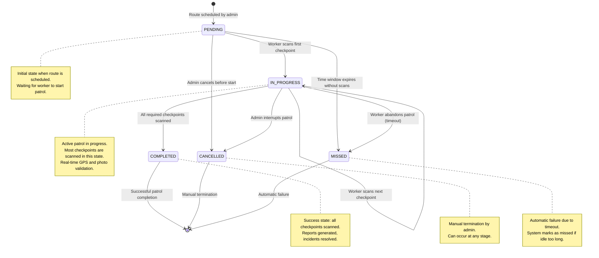

# Patrol Run Lifecycle

This state machine diagram shows how patrol runs transition through different states during their lifecycle. This is essential for
understanding patrol status in the UI and business logic.

## State Descriptions

### PENDING

- **Entry**: Route is created and scheduled by admin
- **Purpose**: Waiting for worker to begin patrol
- **Exits to**:
    - `IN_PROGRESS`: Worker scans first checkpoint
    - `CANCELLED`: Admin cancels scheduled patrol
    - `MISSED`: Time window passes without any scans

### IN_PROGRESS

- **Entry**: Worker scans first checkpoint of the route
- **Purpose**: Active patrol execution with real-time scanning
- **Exits to**:
    - `IN_PROGRESS`: Worker continues scanning next checkpoints (loop)
    - `COMPLETED`: All required checkpoints successfully scanned
    - `CANCELLED`: Admin manually stops the patrol
    - `MISSED`: Worker fails to complete within time constraints

### COMPLETED

- **Entry**: All required checkpoints scanned successfully
- **Purpose**: Terminal success state
- **Business logic**:
    - Patrol report is generated
    - Performance metrics calculated
    - Incidents linked to this patrol are reviewed

### CANCELLED

- **Entry**: Admin manually terminates the patrol
- **Purpose**: Terminal state for interrupted patrols
- **Business logic**:
    - Partial scan data is preserved
    - Reason for cancellation may be recorded
    - Can occur from any non-terminal state

### MISSED

- **Entry**: System automatically marks patrol as failed
- **Purpose**: Terminal failure state due to timeout or abandonment
- **Business logic**:
    - No scans recorded within expected time window (PENDING → MISSED)
    - Patrol started but not completed in time (IN_PROGRESS → MISSED)
    - Alert may be sent to admin

## Implementation Notes

For frontend developers:

- **Poll status** for active patrols (IN_PROGRESS)
- **Show progress bar** based on checkpoints scanned vs. total
- **Display warnings** when approaching timeout (transition to MISSED)
- **Color coding**: Green (COMPLETED), Red (MISSED), Yellow (CANCELLED), Blue (IN_PROGRESS)
