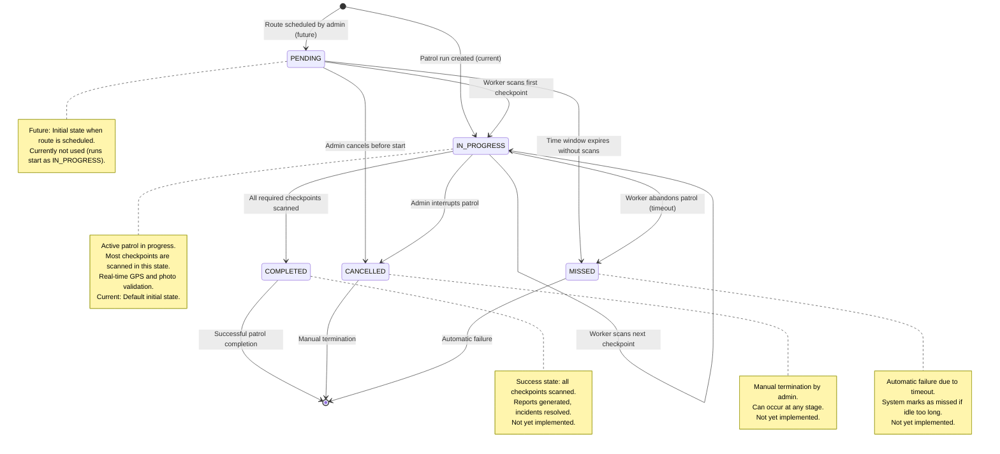

# Patrol Run Lifecycle

This state machine diagram shows how patrol runs transition through different states during their lifecycle. This is essential for
understanding patrol status in the UI and business logic.

**Note:** Current implementation creates patrol runs in `IN_PROGRESS` state immediately. Future updates may implement scheduled patrols
starting in `PENDING`.

## State Descriptions

### PENDING

- **Entry**: Route is created and scheduled by admin (future implementation)
- **Purpose**: Waiting for worker to begin patrol
- **Current status**: Not used - patrol runs start as IN_PROGRESS
- **Exits to**:
    - `IN_PROGRESS`: Worker scans first checkpoint
    - `CANCELLED`: Admin cancels scheduled patrol
    - `MISSED`: Time window passes without any scans

### IN_PROGRESS

- **Entry**: Patrol run is created (current default state)
- **Purpose**: Active patrol execution with real-time scanning
- **Current status**: All patrol runs start in this state
- **Exits to**:
    - `IN_PROGRESS`: Worker continues scanning next checkpoints (loop)
  - `COMPLETED`: All required checkpoints successfully scanned (not implemented)
  - `CANCELLED`: Admin manually stops the patrol (not implemented)
  - `MISSED`: Worker fails to complete within time constraints (not implemented)

### COMPLETED

- **Entry**: All required checkpoints scanned successfully
- **Purpose**: Terminal success state
- **Current status**: Not yet implemented
- **Business logic**:
    - Patrol report is generated
    - Performance metrics calculated
    - Incidents linked to this patrol are reviewed

### CANCELLED

- **Entry**: Admin manually terminates the patrol
- **Purpose**: Terminal state for interrupted patrols
- **Current status**: Not yet implemented
- **Business logic**:
    - Partial scan data is preserved
    - Reason for cancellation may be recorded
    - Can occur from any non-terminal state

### MISSED

- **Entry**: System automatically marks patrol as failed
- **Purpose**: Terminal failure state due to timeout or abandonment
- **Current status**: Not yet implemented
- **Business logic**:
    - No scans recorded within expected time window (PENDING → MISSED)
    - Patrol started but not completed in time (IN_PROGRESS → MISSED)
    - Alert may be sent to admin

## Implementation Notes

For frontend developers:

- **Current state**: All patrol runs start in IN_PROGRESS (see `PatrolRunService.createRun()`)
- **Poll status** for active patrols (IN_PROGRESS)
- **Show progress bar** based on checkpoints scanned vs. total
- **Color coding**: Green (COMPLETED), Red (MISSED), Yellow (CANCELLED), Blue (IN_PROGRESS)
- **Future implementation**: State transitions (COMPLETED, CANCELLED, MISSED) and warnings for approaching timeout
