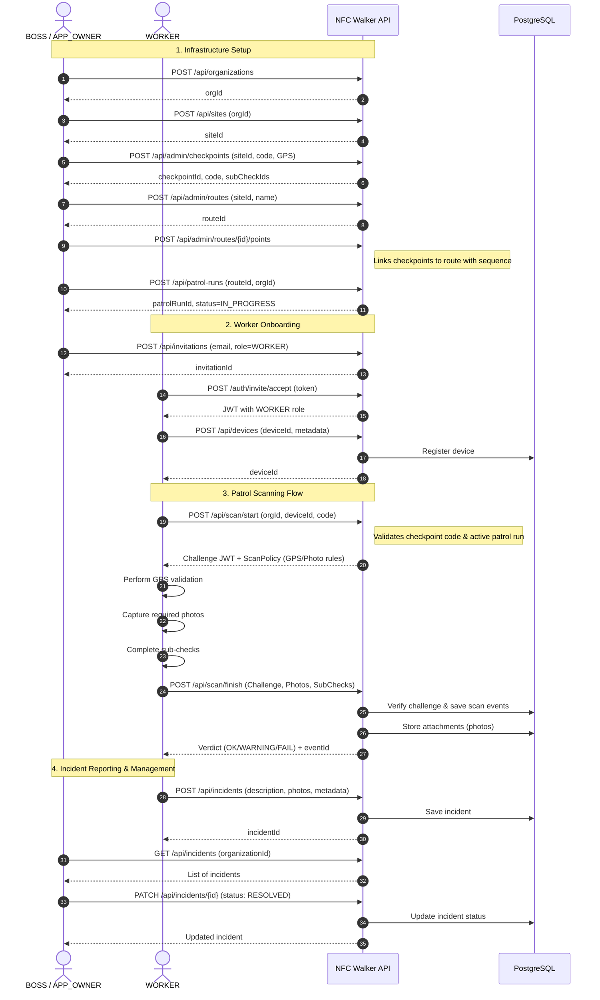

# System User Flows

This diagram shows how different roles interact with the NFC Walker API across the complete lifecycle: from organization setup through
worker patrol execution.

## API Flow Details

### 1. Infrastructure Setup (Admin)

- Creates hierarchical structure: Organization → Site → Checkpoint → Route
- Each checkpoint has unique code (e.g., "CP-101") for NFC scanning
- Routes link multiple checkpoints in sequence with timing constraints
- Creates patrol run instance (status: IN_PROGRESS by default)

### 2. Worker Onboarding

- Admin invites worker via email
- Worker accepts invitation and receives JWT token with WORKER role
- Worker registers device(s) for patrol operations

### 3. Patrol Scanning

- Two-phase scan: `start` (get challenge) → `finish` (submit results)
- Challenge JWT prevents replay attacks and ensures scan freshness
- ScanPolicy defines GPS tolerance, photo requirements, sub-checks
- System validates GPS coordinates, photos, and sub-check completion
- Returns verdict: OK (no issues), WARNING (problems found or incidents), FAIL (validation failed)

### 4. Incident Management

- Workers report issues during patrol (embedded in finish scan) or standalone
- Admins review and resolve incidents
- Full audit trail maintained in database
- Photos can be attached to incidents
